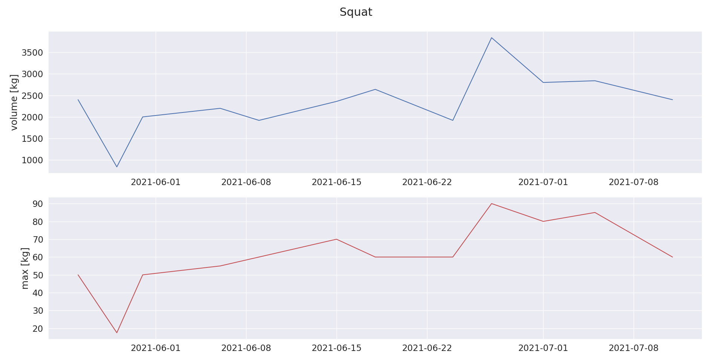
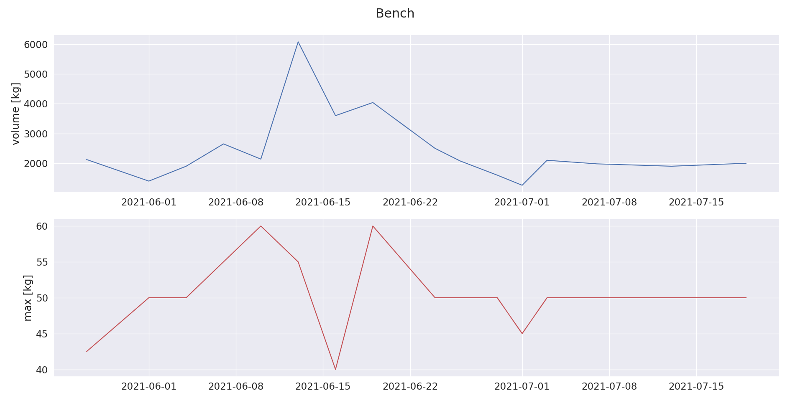
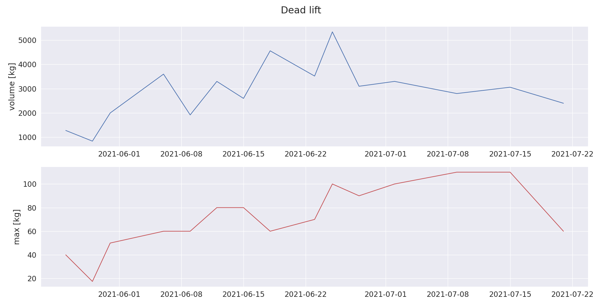
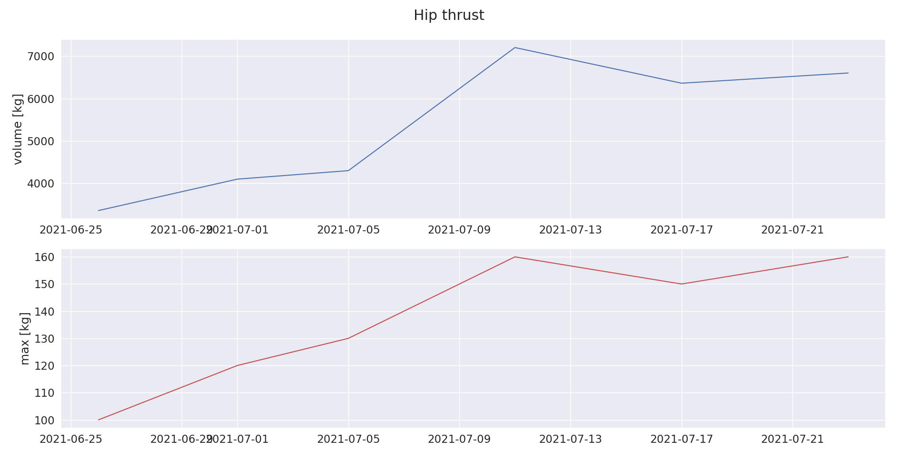

<!-- <p align="center"> -->
<!--    -->
<!-- </p> -->
<p align="center">Track workouts and progress steadily.</p>

<p align="center">
  <a href="https://github.com/mastermedo/workouts/LICENSE">
    
  </a>
  <a href="https://github.com/mastermedo/workouts">
    
  </a>
  <a href="https://github.com/mastermedo/workouts/stargazers">
    
  </a>
</p>

<!-- <p align="center"> -->
<!--   <a href="https://github.com/mastermedo/workouts"> -->
<!--      -->
<!--   </a> -->
<!-- </p> -->

## :clipboard: description

`workouts` visualises progress in maximum weight and weight volume for every exercise you're performing from a specific data format you write after each exercise.

You record your exercises in `datasets/workouts/workouts.txt` in the following format:
```
DATE [DESCRIPTION]
  EXERCISE_NAME ([WEIGHT][UNIT] [SETS]xREPS)...

2023.04.13 17:30
  squat 80kg 4x12
  deadlift 70kg x12 80kg 2x5 90kg x3
```

Then you run `blaze run src/python:analyse_workouts` and it draws the progress of the maximum weight you lifted and total weight volume lifted on a particular day.



# How I use it

While doing a workout, I write workouts in Google Keep on my phone.
Every so often, I copy those notes into the `/datasets/workouts/workouts.txt` and run `blaze run src/python:analyse_workouts`.
Then I inspect the maximum weight and weight volume progress on particular exercises and adjust my future workouts to maintain the progress.

The goal is to keep progressively increasing volume and/or maximum weight.

## :chart_with_upwards_trend: analyse workout results

Here are some graphs of my progress for popular exercises when I started working out:






## future work

1. Make the program easy to install and use by others.
1. Show weekly strain of a particular muscle group.
1. Identify underworked muscles and suggest exercises for them.
1. Suggest weight to lift, and number of sets and reps to do for an exercise.

<p align="center">
  <a href="#">
    
  </a>
</p>
