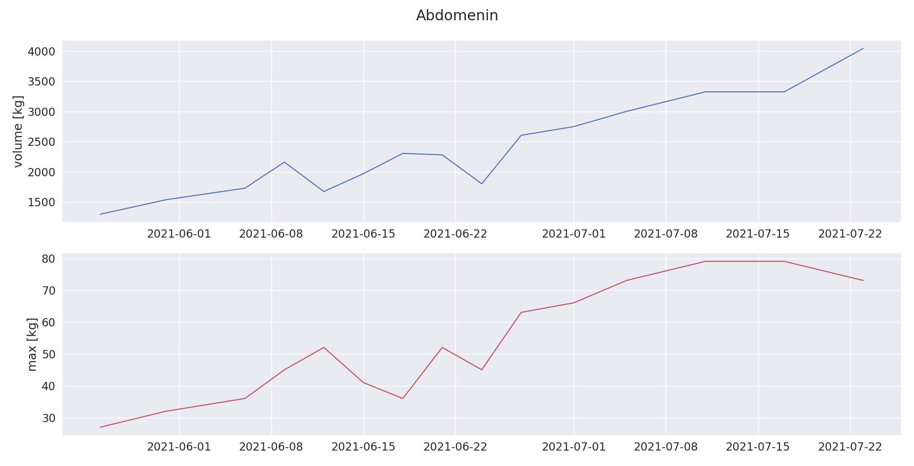
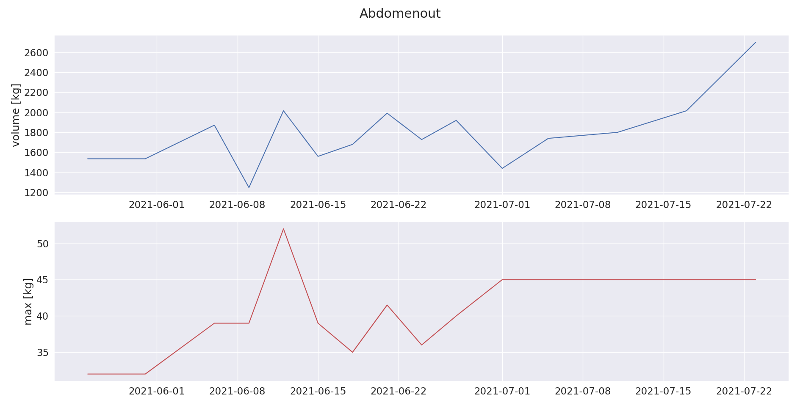
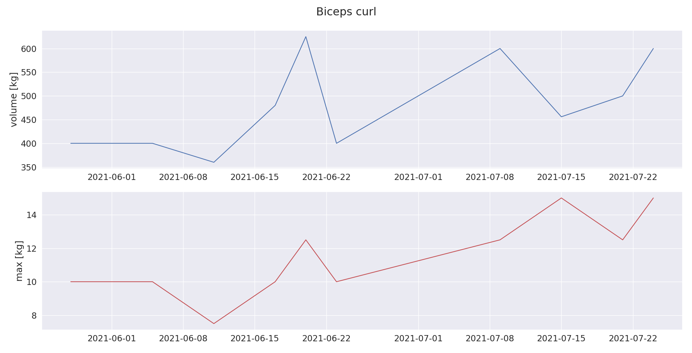
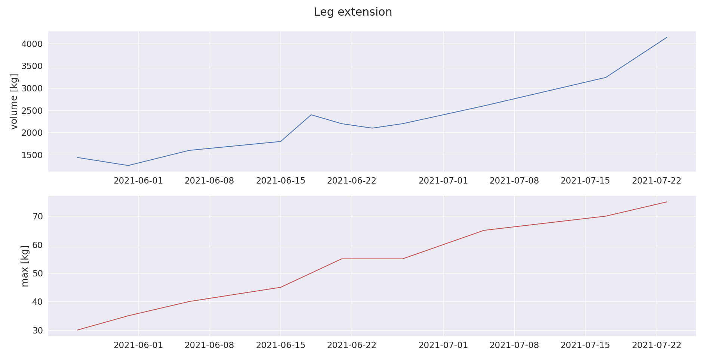
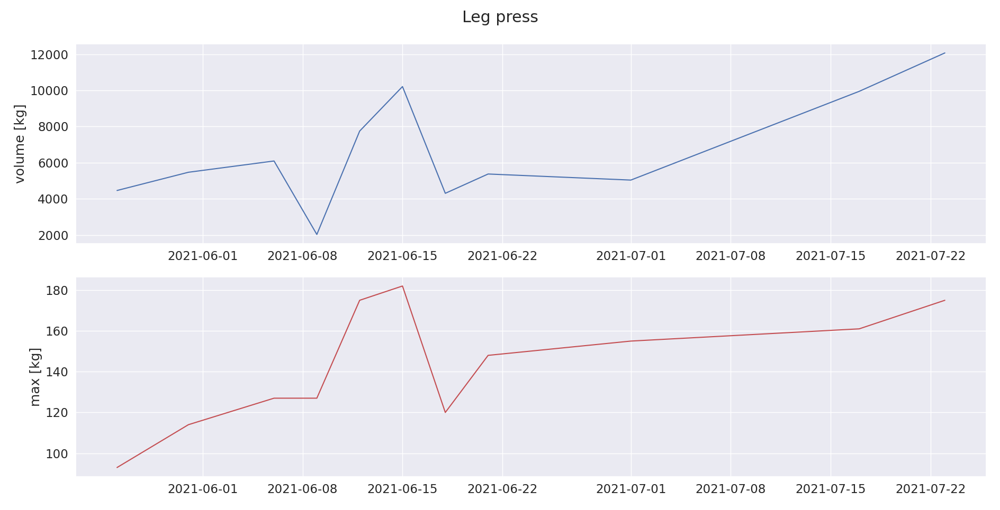
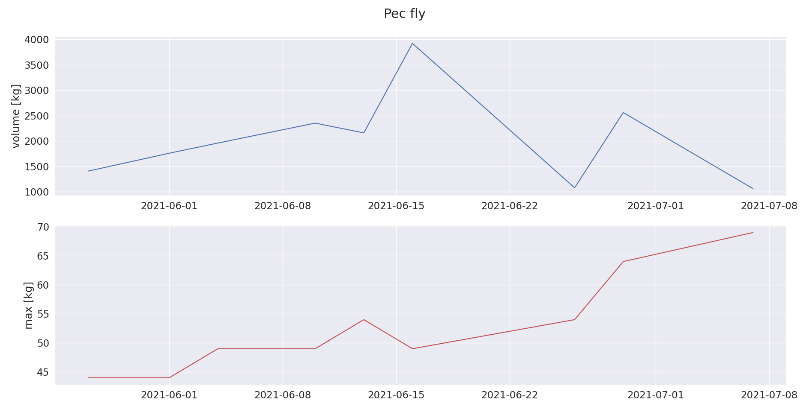

<!-- 
 -->
<!--    -->
<!-- 
 -->

Track workouts and progress steadily.

  
  
  

<!-- 
 -->
<!--   <a href="https://github.com/mastermedo/workouts"> -->
<!--      -->
<!--   </a> -->
<!-- 
 -->

## :clipboard: description
`workouts` let's you analyse your workout data, so you can make insights about it and adjust your schedule to meet your goals quicker.

## :zap: features
- parse workouts from a simple form
- analyse workouts

## :chart_with_upwards_trend: analyse workout results

## :shipit: installation
## :bulb: ideas for tests
## :question: usage

  

